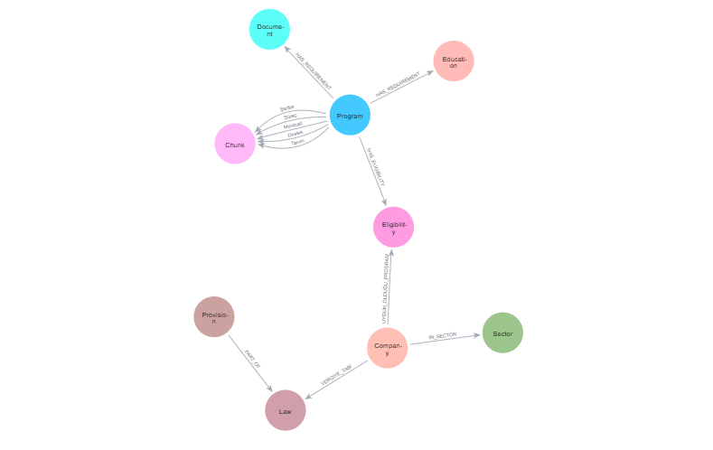
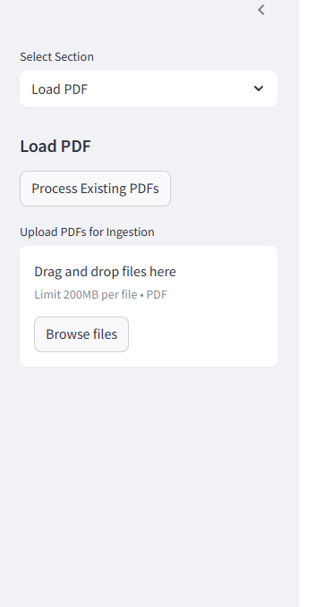
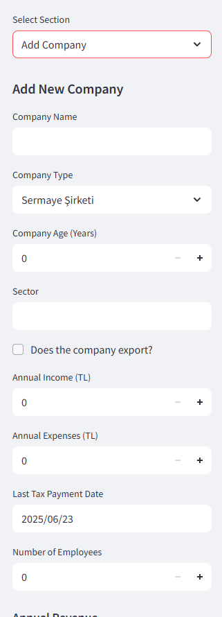
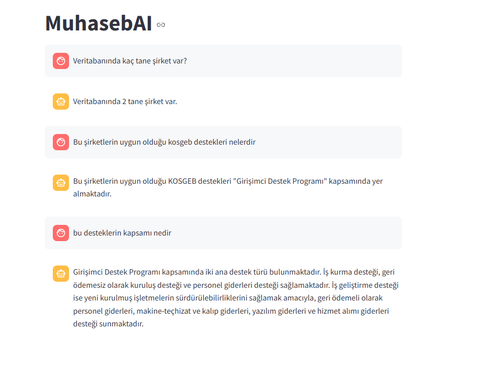

# MuhasebAI - Muhasebe ve Vergi Asistanı

# Accounting AI Assistant

**Accounting AI Assistant** is an intelligent, interactive tool that processes natural language queries and provides insights over accounting data. Powered by large language models (LLMs), it transforms user input into Cypher queries for a Neo4j graph database, and supports semantic understanding and conversational AI. The app is built using LangChain, Neo4j, Streamlit, and embedding-based search techniques.

## 🚀 Features




- 🔍 **Natural Language Querying** – Ask questions in plain language, get data-driven responses.
- 🔄 **LLM to Cypher Translation** – Converts user input into Cypher queries to interact with the Neo4j database.
- 🤖 **Conversational Chatbot** – Chat with an AI-powered assistant using context-aware, memory-supported interactions.
- 🧠 **Semantic Search** – Uses semantic embeddings to find and rank relevant documents or data.
- 🧩 **Chunk-Based Embedding** – Splits long documents into smaller chunks for more effective indexing and retrieval.
- 🕸️ **Graph-Based Data Modeling** – Models accounting data and relationships using Neo4j’s graph database engine.
- ⚡ **Easy Data Upload** – Upload your data quickly and effortlessly via the app interface.


- 💻 **Streamlit Interface** – Clean, interactive frontend built with Streamlit.




## 🛠️ Technologies Used

- **[LangChain](https://www.langchain.com/):** Framework for building LLM-powered apps
- **[Neo4j](https://neo4j.com/):** Graph database for modeling relationships
- **[Streamlit](https://streamlit.io/):** Python-based web app framework
- **LLM-to-Cypher Translation:** Transforms natural language into Cypher queries via LLMs
- **Chatbot Integration:** LLM-driven conversational agent
- **Semantic Embedding:** Vector-based semantic understanding
- **Chunk Embedding:** Efficient retrieval from large text segments

## 📦 Installation

```bash
git clone https://github.com/batuhantug/Muhasebe-AI-Asistan.git
cd Muhasebe-AI-Asistan
create streamlit/secret.toml


